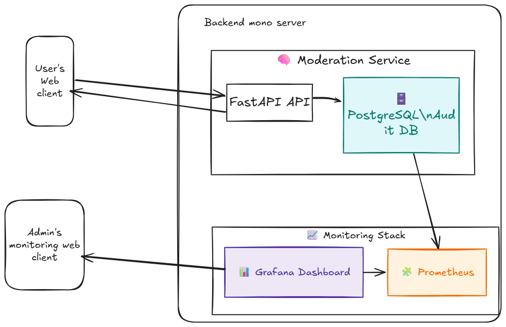

# Architecture Diagram

## System Architecture Overview



## Architecture Components

### 1. Frontend Layer (React)
- **Chat Interface**: User-facing chat UI with LLM provider selection
- **Admin Panel**: Management interface for moderation rules and audit logs
- **Region Selector**: Allows users to select compliance region (GDPR, HIPAA, etc.)

### 2. Backend API Layer (FastAPI)
- **Chat API** (`/api/v1/chat`): Handles user messages and generates responses
- **Admin API** (`/api/v1/admin`): Manages rules, retrieves audit logs
- **Middleware**: CORS, request validation, error handling

### 3. LLM Integration Layer
- **Mock Provider**: Test responses for moderation testing (free)
- **OpenAI Integration**: GPT-3.5-turbo / GPT-4 integration
- **Anthropic Integration**: Claude models (not yet implemented)
- **Ollama Integration**: Local LLM support (not yet implemented)
- **Dynamic Provider Selection**: Users can switch providers per-request

### 4. Moderation Engine (Core)
- **100% Interception**: All responses pass through moderation
- **Rule Execution**: Priority-based rule evaluation
- **ML Detection**:
  - Toxicity Detection (Detoxify model)
  - PII Detection (regex-based)
  - Medical/Financial Term Detection
- **Region-Specific Rules**: GDPR (EU), HIPAA (US), Global
- **Fallback Mechanism**: User-friendly error messages for blocked content

### 5. Database Layer (PostgreSQL)
- **moderation_rules**: Rule definitions and configurations
- **audit_logs**: Flagged responses with full metadata (user message, LLM response, final response)
- **Indexed Queries**: Fast lookup by region, rule type, timestamp

### 6. Monitoring Stack
- **Prometheus**: Metrics collection (interception rate, latency, rule triggers)
- **Grafana**: Visualization dashboards at http://localhost:3001
- **Alerting**: Real-time alerts for interception failures and errors

## Data Flow

### Request Flow (100% Interception)
```
1. User sends message via Frontend
   ↓
2. Frontend → POST /api/v1/chat (with region + llm_provider)
   ↓
3. Backend generates LLM response (OpenAI/Mock/etc.)
   ↓
4. ⚠️ CRITICAL: Moderation intercepts response (100%)
   ↓
5. Rules applied (priority order):
   - PII Detection
   - Toxicity Check
   - Medical/Financial Terms
   - Regional Compliance Rules
   ↓
6. Decision:
   - ✅ ALLOWED: Return original response
   - ⚠️ FLAGGED: Log to audit_logs, return original
   - 🚫 BLOCKED: Log to audit_logs, return fallback message
   ↓
7. Response sent to user
   ↓
8. Metrics tracked in Prometheus
```

## Key Features

### ✅ Implemented
- ✅ 100% response interception
- ✅ ML-based toxicity detection
- ✅ PII detection (email, phone, SSN, credit cards)
- ✅ Region-specific rules (GDPR, HIPAA, Global)
- ✅ Admin APIs for rule management
- ✅ Comprehensive audit logging (flagged responses only)
- ✅ Fallback messages for blocked content
- ✅ Dynamic LLM provider selection
- ✅ Prometheus + Grafana monitoring
- ✅ Real-time alerting

### 🚧 Planned
- 🚧 Anthropic (Claude) integration
- 🚧 Ollama (local LLM) integration
- 🚧 Advanced ML models for content detection
- 🚧 Custom rule templates
- 🚧 Bulk rule import/export

## Technology Stack

| Layer | Technology | Purpose |
|-------|------------|---------|
| **Frontend** | React.js | User interface |
| **Backend** | FastAPI (Python) | REST API |
| **Database** | PostgreSQL 15 | Persistent storage |
| **ML Models** | Detoxify (transformers) | Toxicity detection |
| **LLM Providers** | OpenAI, Mock | Response generation |
| **Monitoring** | Prometheus + Grafana | Metrics & dashboards |
| **Containerization** | Docker + Docker Compose | Deployment |

## Deployment

The system runs in Docker containers:

```yaml
services:
  - postgres:5432      # Database
  - backend:8000       # FastAPI API
  - frontend:3000      # React UI
  - prometheus:9090    # Metrics
  - grafana:3001       # Dashboards
```

## Security & Compliance

### Data Privacy
- Audit logs only store flagged responses (as per requirements)
- PII detected but not stored in detail
- UUID-based request IDs (unpredictable)

### Regional Compliance
- **GDPR (EU)**: Privacy-focused rules, data minimization
- **HIPAA (US)**: Medical term detection, health data protection
- **Global**: General content moderation

### Monitoring
- All interception failures trigger critical alerts
- False positive rate tracked (<0.1% target)
- Moderation latency tracked (P50, P95, P99)

## Performance

- **Target Latency**: Moderation adds minimal overhead
- **Scalability**: Stateless design, horizontal scaling ready
- **Caching**: ML models loaded once at startup
- **Database**: Indexed queries for fast lookups

## Additional Resources

- [README.md](README.md) - Quick start guide
- [DOCKER_QUICKSTART.md](DOCKER_QUICKSTART.md) - Docker setup
- [METRICS_GUIDE.md](backend/METRICS_GUIDE.md) - Monitoring details
- [TESTING.md](backend/TESTING.md) - Test documentation
- [LLM_INTEGRATION.md](LLM_INTEGRATION.md) - LLM provider setup

---

**Note**: Place your architecture diagram PNG file at `assets/images/architecture.png` to display it in this document.
